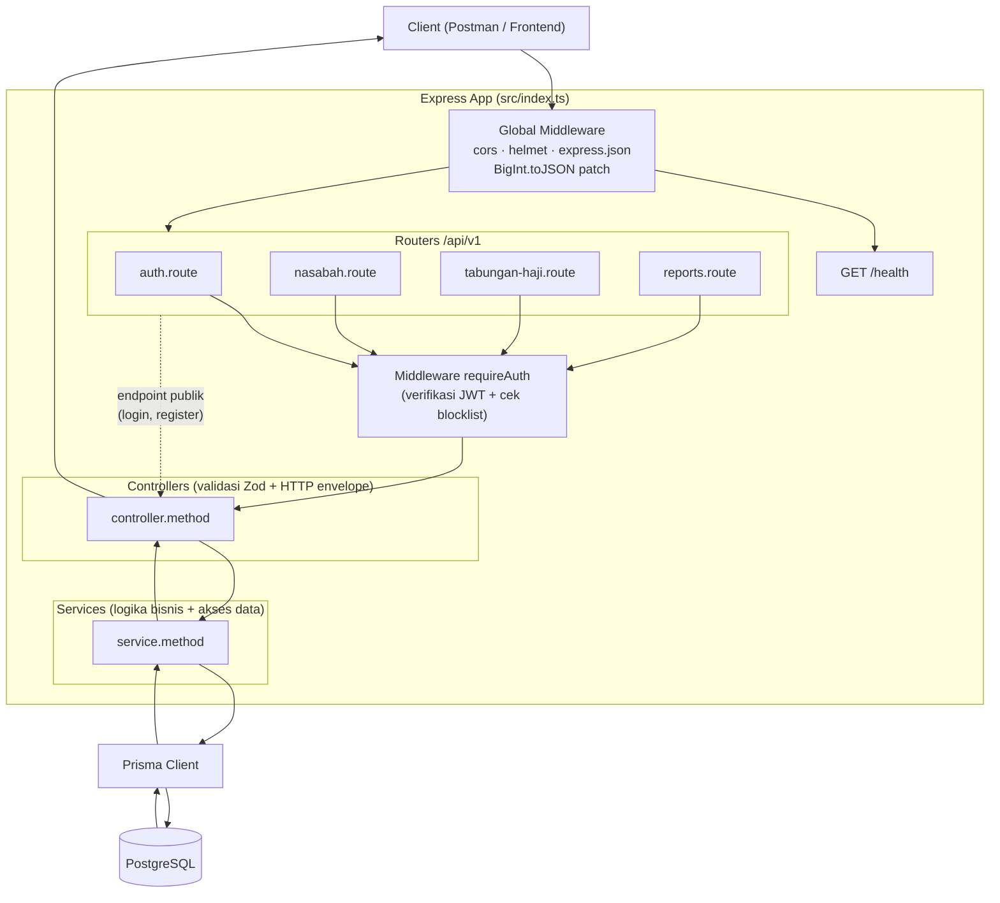
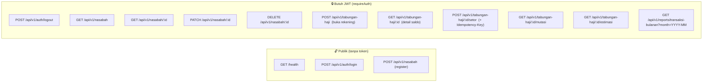
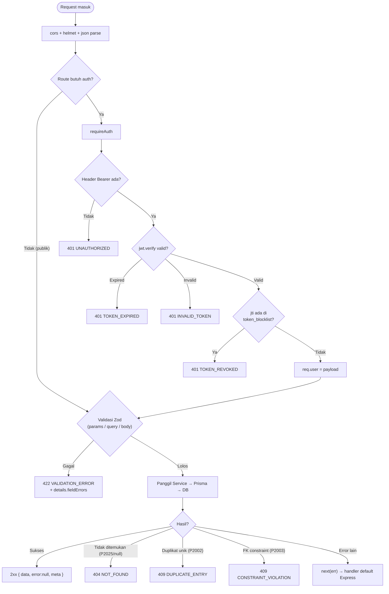
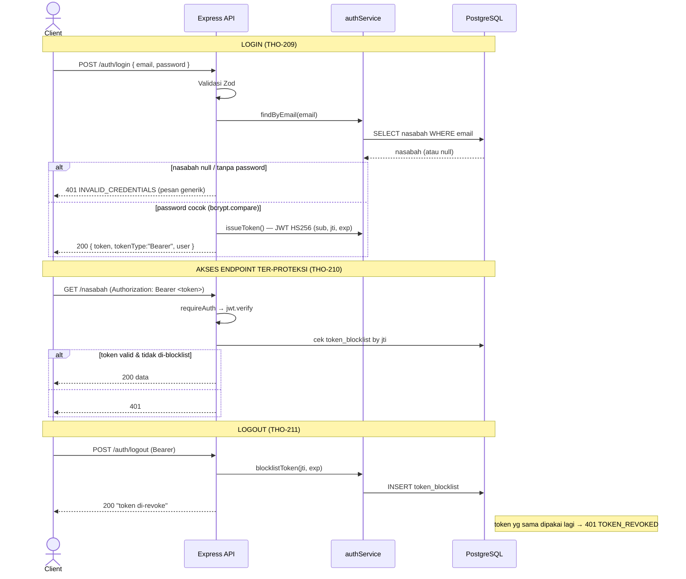
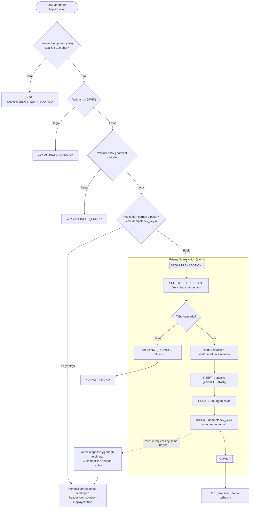
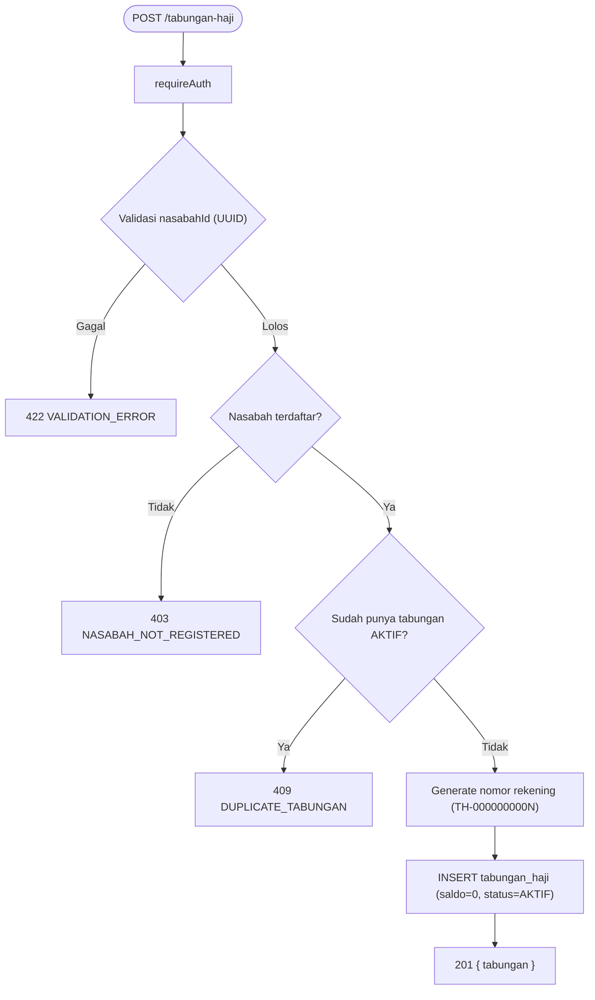
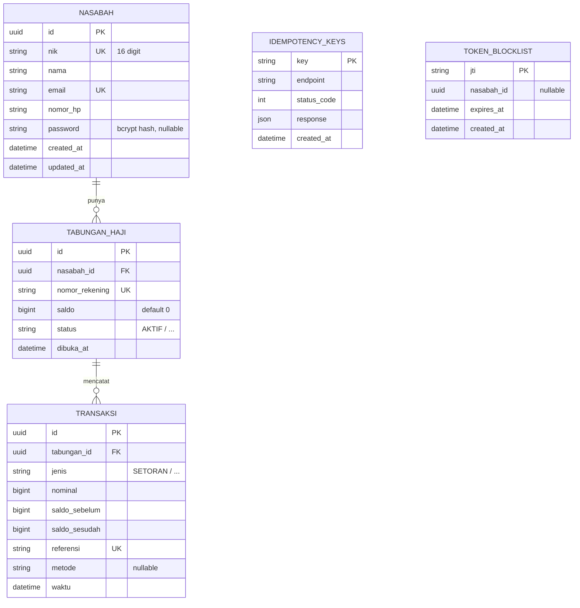

# Flowchart Sistem — Tabungan Haji API

Dokumen ini berisi diagram alur sistem dalam format **Mermaid**.
Untuk melihat render-nya: buka di GitHub, atau di VSCode pakai ekstensi *Markdown Preview Mermaid Support*.

Stack: **Express 5 + TypeScript + Prisma 6 + PostgreSQL + Zod + JWT**.

---

## 1. Arsitektur Berlapis (Layered Architecture)

Tiap request mengalir lewat lapisan yang sama: Route → (Auth) → Controller (validasi) → Service (logika + DB) → Prisma → PostgreSQL.

---

## 2. Peta Endpoint & Proteksi

---

## 3. Lifecycle Request Umum (jalur ter-proteksi)

Pola yang dipakai semua controller: validasi dulu, baru sentuh DB, lalu map error → HTTP.

> Semua response sukses & error memakai envelope konsisten: `{ data, error, meta:{ timestamp } }`.

---

## 4. Flow Autentikasi (Login → Pakai Token → Logout)

---

## 5. Flow Setor Saldo (THO-206) — Idempotency + DB Transaction

Endpoint paling kompleks. Pakai **Idempotency-Key** (anti dobel-setor) + **transaksi DB** dengan **row lock `FOR UPDATE`** (anti race / double-spend).

---

## 6. Flow Buka Rekening (THO-205)

---

## 7. Model Data (ERD)

> `IDEMPOTENCY_KEYS` & `TOKEN_BLOCKLIST` berdiri sendiri (tidak ada FK formal ke nasabah) — dipakai sebagai mekanisme idempotensi setoran dan revoke token JWT.
